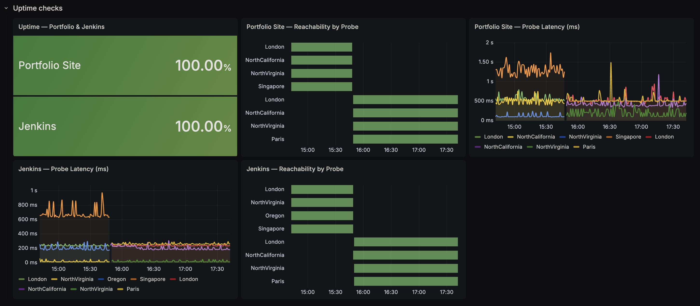
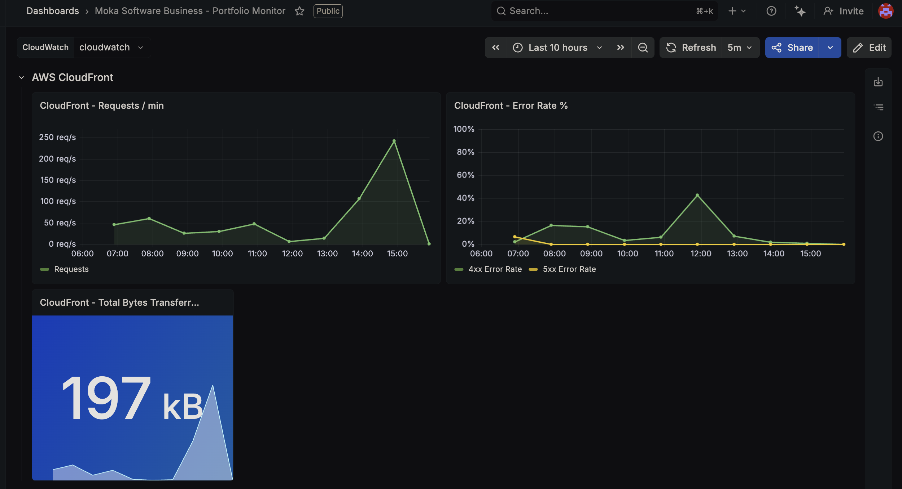
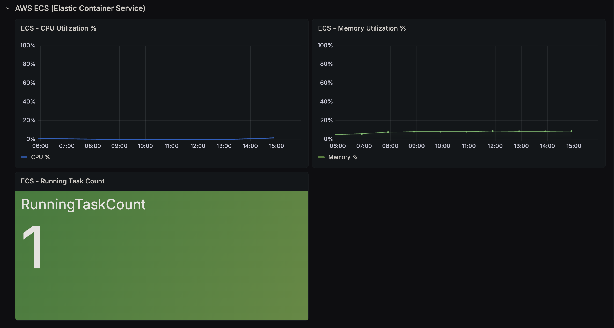
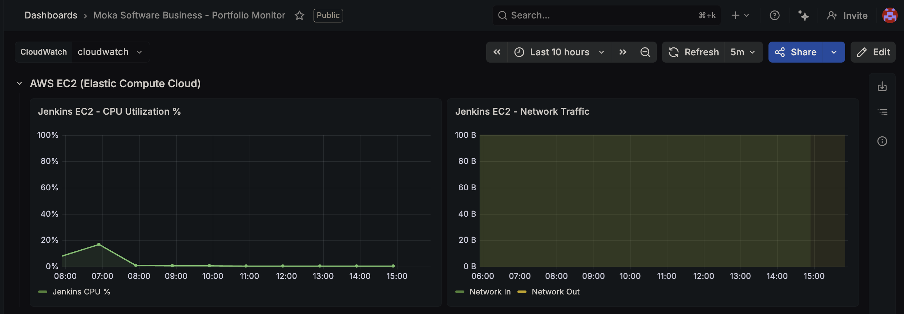

<div align="center">

<h1>MokaSoftware Business</h1>

<p><strong>Production-grade Next.js 14 portfolio &middot; Containerised &middot; Automated CI/CD to AWS ECS Fargate</strong></p>

<p>
  <a href="https://mokasoftwarebusness.com"></a>
</p>

<p>
  
  
  
  
  
  
  
</p>

Personal freelance portfolio for **Bernard D. Mokalo** — Principal Software Engineer & DevOps/Cloud specialist.  
Available in **5 languages** &middot; **Dark / light theme** &middot; **Containerised** &middot; **Automated CI/CD to AWS**

</div>

---

## Table of Contents

- [Tech Stack](#tech-stack)
- [Architecture](#architecture)
- [Monitoring & Observability](#monitoring--observability)
- [Project Structure](#project-structure)
- [Running Locally](#running-locally)
- [Running Tests Locally](#running-tests-locally)
- [Docker (local container)](#docker-local-container)
- [CI/CD Pipeline](#cicd-pipeline)
- [Environment Variables](#environment-variables)
- [AWS Cost Guide](#aws-cost-guide)
- [Customisation](#customisation)
- [License](#license)

---

## Tech Stack

| Layer | Technology | Notes |
|---|---|---|
| **Framework** | [Next.js 14](https://nextjs.org) | App Router · SSR · `output: 'standalone'` for Docker |
| **Language** | TypeScript 5 | Strict mode enabled |
| **Styling** | Tailwind CSS 3 + CSS custom properties | Design tokens for light/dark theme |
| **i18n** | [next-intl 3](https://next-intl-docs.vercel.app) | 5 locales: `en` · `fr` · `es` · `de` · `pt` |
| **Fonts** | Inter · Space Grotesk | Via `next/font/google` (zero layout shift) |
| **Contact form** | [Formspree](https://formspree.io) | No backend / email server required |
| **Testing** | Jest 30 · React Testing Library · `@testing-library/user-event` | 13 test files · 121 tests |
| **Container** | Docker — Node 20 Alpine, 3-stage build | Non-root user · ~150 MB final image |
| **CI/CD** | Jenkins Declarative Pipeline | Shared library [`jenkins-nextjs-lib`](https://github.com/mokasofthub/jenkins-nextjs-lib) |
| **Image registry** | Amazon ECR | Auto-created · lifecycle: keep last 5 images |
| **Compute** | Amazon ECS Fargate | 256 CPU · 512 MB · public subnet · port 3000 |
| **CDN** | Amazon CloudFront | HTTPS · edge caching · custom domain |

---

## Architecture

### Production infrastructure

```
  User (browser / mobile)
          │  HTTPS  mokasoftwarebusness.com
          ▼
  ┌───────────────────────────────┐
  │           Route 53            │  ← DNS · mokasoftwarebusness.com → CloudFront alias
  │                               │    origin.mokasoftwarebusness.com → ECS task IP
  └───────────────────────────────┘
          │
          ▼
  ┌───────────────────────────────┐
  │       CloudFront CDN          │  ← HTTPS termination · edge caching · DDoS protection
  │  dyibh68p1l7w0.cloudfront.net │    distribution E2MZ1JOJMAKL7T
  └───────────────────────────────┘
          │  HTTP :3000  (origin request on cache miss)
          ▼
  ┌─────────────────────────────────────────┐
  │           AWS ECS Fargate               │
  │  ┌───────────────────────────────────┐  │
  │  │  Next.js 14  (standalone mode)    │  │  256 CPU · 512 MB · public subnet
  │  │  Node 20 Alpine container         │  │  Port 3000
  │  └───────────────────────────────────┘  │
  └─────────────────────────────────────────┘
          │  pulls image on deploy
          ▼
  ┌───────────────────┐        ┌──────────────────────────┐
  │   Amazon ECR      │        │      Jenkins (EC2)        │
  │  image registry   │        │  CI/CD · Docker daemon   │
  │  keep last 5      │        │  GitHub webhook listener  │
  └───────────────────┘        └──────────────────────────┘

  ─ ─ ─ ─ ─ ─ ─ ─ ─  Observability  ─ ─ ─ ─ ─ ─ ─ ─ ─ ─

  ┌─────────────────────────────────────────────────────┐
  │                  Grafana Cloud                      │
  │  CloudWatch metrics ──► CloudFront · ECS · EC2      │
  │  Synthetic probes   ──► Uptime · Latency (4 regions)│
  │  Public dashboard → dbed62c3868144f19ad729f899a32f78│
  └─────────────────────────────────────────────────────┘
```

### CI/CD flow

```
  Developer
      │  git push / open PR
      ▼
  GitHub repository
      │  webhook  →  POST /github-webhook/
      ▼
  Jenkins (EC2)
      │
      ├─ [all branches & PRs]
      │     Checkout → Install → Lint → Test → Build
      │
      └─ [main branch only]
            Docker Build & Push to ECR
                  → Register new ECS task definition
                  → aws ecs update-service
                  → wait services-stable
                  → Update origin.mokasoftwarebusness.com A record (new task IP)
                  → CloudFront cache invalidation (E2MZ1JOJMAKL7T)
```

### Application layers

```
  messages/           ← Translation JSON (en / fr / es / de / pt)
      │
  src/middleware.ts   ← next-intl routing (locale detection & redirect)
      │
  src/app/[locale]/   ← Per-locale layout + root page
      │
  src/app/components/ ← All UI sections: Hero · About · Services · Projects ·
      │                  Pricing · Skills · Contact · Navbar · Footer · BottomNav
      │
  src/lib/utils.ts    ← Pure shared helpers (e.g. isValidEmail)
```

---

## Monitoring & Observability

The production infrastructure is fully observable via a **[public Grafana dashboard](https://mokasoftwarebusness.grafana.net/public-dashboards/dbed62c3868144f19ad729f899a32f78)** — no login required.

Metrics are collected from three AWS services via **CloudWatch** and from **Grafana Synthetic Monitoring** (Prometheus-based uptime checks).

### Monitored components

| Component | Role in production |
|---|---|
| **CloudFront CDN** | Global edge layer — the public face of the app. Terminates HTTPS, caches static assets at 450+ edge locations, shields the origin from direct internet exposure. Every user request hits CloudFront first. |
| **ECS Fargate** | Application runtime — runs the Next.js container (256 vCPU · 512 MB). Serverless: AWS manages the host, you only define CPU/RAM. A new task is started on every deploy; the old one is stopped once the new one is healthy. |
| **Jenkins EC2** | CI/CD engine — self-hosted because it needs the Docker daemon and persistent layer cache. Listens for GitHub webhooks and runs the full pipeline: install → lint → test → build → push to ECR → deploy to ECS → update DNS → invalidate CloudFront. |

---

### Uptime Checks — Global Probe Reachability



**What it shows:**
- **Uptime % stat panels** (top) — percentage of successful probes over the last 6 hours for both the portfolio site and Jenkins. Color-coded: green ≥ 99%, yellow ≥ 90%, red below.
- **Reachability state timeline** (middle) — per-probe UP/DOWN history over time. Each row is one of the 4 global probe locations (London, N. Virginia, Oregon, Singapore). Green = UP, red = DOWN.
- **Latency time series** (bottom) — response time in milliseconds per probe location. Highlights geographic performance differences and detects latency spikes before they become outages.

**Why it matters:** Synthetic checks run every minute from 4 global locations independently of CloudWatch. They confirm end-to-end reachability from the user's perspective — DNS, CloudFront, ECS, and the app all have to be healthy for a probe to succeed. If the site goes down, the alert fires within 2 minutes with no instrumentation code required in the app.

---

### CloudFront CDN Metrics



**Role:** CloudFront is the only component directly exposed to the internet. It terminates HTTPS, caches responses at the edge, and forwards cache misses to the ECS origin. The app's custom domain (`mokasoftwarebusness.com`) resolves to the CloudFront distribution — ECS is never directly reachable by end users.

**What it shows:**
- **Request rate** — total HTTP requests served by the CloudFront distribution over time. A sudden drop can indicate a deployment failure or DNS issue; a spike confirms traffic events.
- **Error rate (4xx / 5xx)** — percentage of requests returning client or server errors. Under normal operation this stays at 0%; any non-zero value triggers investigation.
- **Bytes transferred** — total data egress from the CDN edge. Useful for estimating bandwidth costs and confirming cache effectiveness (high cache-hit ratio = low origin traffic).

**Why it matters:** Monitoring CloudFront separately from the origin makes it possible to distinguish *where* a problem is. If error rate spikes here but ECS CPU is flat, the issue is at the edge (misconfigured cache rule, bad invalidation). If CloudFront is clean but uptime probes fail, the problem is DNS or the origin itself.

---

### AWS ECS Fargate Metrics



**Role:** ECS Fargate is where the Next.js application actually runs. Fargate is serverless containers — there are no EC2 instances to patch or scale; AWS manages the underlying infrastructure. The task runs in a public subnet and receives traffic directly from CloudFront on port 3000. On each deploy, Jenkins registers a new task definition revision, triggers `update-service`, and waits for `services-stable`.

**What it shows:**
- **CPU utilisation %** — percentage of the allocated 256 vCPU units consumed by the running container. A sustained spike above 80% indicates the task definition needs resizing.
- **Memory utilisation %** — percentage of the allocated 512 MB RAM in use. Crossing 90% risks the OS OOM-killing the container, causing a brief outage until ECS restarts the task.
- **Running task count** — number of Fargate tasks in the `RUNNING` state. Normally 1; dropping to 0 means the service is completely unavailable.

**Why it matters:** ECS metrics are the ground truth for application health. After a deploy the running task count must return to 1 within ~30 s and CPU should settle below 10% at idle. Any deviation here points to a container crash, a bad image, or insufficient resources.

---

### Jenkins EC2 Metrics



**Role:** Jenkins runs on a dedicated EC2 instance (not Fargate) because it needs the Docker daemon for building images and benefits from a persistent disk cache for `node_modules` and Docker layers. It is the only infrastructure component not managed by a scaling group, making direct monitoring essential.

**What it shows:**
- **CPU utilisation %** — CPU load on the EC2 instance. Spikes are expected during active pipeline runs (install, lint, test, build, Docker build). Sustained high CPU *outside* of deploy windows indicates a runaway process or a queued backlog.
- **Network In / Network Out (bytes)** — bytes received and sent. `NetworkIn` spikes during `npm ci` (pulling node_modules) and Docker layer pulls from ECR. `NetworkOut` spikes during `docker push` to ECR. Correlating these with pipeline logs helps pinpoint slow stages.

**Why it matters:** Unlike ECS, there is no self-healing for this instance. A silent failure — full disk, memory leak, or zombie process — slows or blocks every future deploy without throwing an obvious error. Network Out going to zero outside of a deploy window is an early sign of connectivity loss to ECR or AWS APIs.

---

## Project Structure

```
moka-software-business/
│
├── messages/                        # i18n translation files (one JSON per locale)
│   ├── en.json
│   ├── fr.json
│   ├── es.json
│   ├── de.json
│   └── pt.json
│
├── docs/
│   └── screenshots/                 # Grafana dashboard screenshots (referenced in README)
│       ├── grafana-cloudfront-metrics.png
│       ├── grafana-ecs-metrics.png
│       ├── grafana-ec2-metrics.png
│       └── grafana-uptime-checks.png
│
├── public/                          # Static assets — icons, manifest.json
│
├── src/
│   ├── app/
│   │   ├── [locale]/
│   │   │   ├── layout.tsx           # Per-locale layout (ThemeProvider + NextIntlClientProvider)
│   │   │   └── page.tsx             # Root page — assembles all section components
│   │   │
│   │   ├── components/
│   │   │   ├── About.tsx            # Bio, skill tags, quick-fact cards
│   │   │   ├── BackToTop.tsx        # Floating scroll-to-top button
│   │   │   ├── BottomNav.tsx        # Mobile floating navigation bar (6 items)
│   │   │   ├── BrandLogo.tsx        # Shared logo wordmark
│   │   │   ├── Card3D.tsx           # Mouse-tracking 3D tilt + glare wrapper
│   │   │   ├── Contact.tsx          # Client-side validated form → Formspree; prefill via event/sessionStorage
│   │   │   ├── Footer.tsx           # Footer links + copyright
│   │   │   ├── Hero.tsx             # Name, title, key metrics, primary CTAs
│   │   │   ├── Monitoring.tsx       # Infrastructure & Monitoring section — Grafana live dashboard CTA
│   │   │   ├── Navbar.tsx           # Sticky nav · theme toggle · locale switcher · mobile drawer
│   │   │   ├── Pricing.tsx          # 3-tab service catalog (web / engineering / support)
│   │   │   ├── Projects.tsx         # Case study cards + modal
│   │   │   ├── Services.tsx         # 9-card service grid with expand/collapse
│   │   │   ├── Skills.tsx           # Technology inventory grouped by category
│   │   │   ├── ThemeProvider.tsx    # React context — dark/light + localStorage persistence
│   │   │   │
│   │   │   └── __tests__/           # Component test files (Jest + RTL)
│   │   │       ├── About.test.tsx
│   │   │       ├── BottomNav.test.tsx
│   │   │       ├── Card3D.test.tsx
│   │   │       ├── Contact.test.tsx
│   │   │       ├── Footer.test.tsx
│   │   │       ├── Hero.test.tsx
│   │   │       ├── Monitoring.test.tsx
│   │   │       ├── Navbar.test.tsx
│   │   │       ├── Pricing.test.tsx
│   │   │       ├── Projects.test.tsx
│   │   │       ├── Services.test.tsx
│   │   │       └── ThemeProvider.test.tsx
│   │   │
│   │   ├── globals.css              # CSS tokens · Tailwind layers · animations
│   │   └── layout.tsx               # Root layout (HTML lang attribute)
│   │
│   ├── lib/
│   │   └── utils.ts                 # Pure helpers (isValidEmail, etc.)
│   │
│   ├── __tests__/
│   │   └── utils.test.ts            # Unit tests for utils
│   │
│   ├── i18n.ts                      # next-intl config (locales, defaultLocale)
│   └── middleware.ts                # next-intl routing middleware
│
├── Dockerfile                       # Multi-stage production container image
├── .dockerignore
├── Jenkinsfile                      # CI/CD entry point — uses jenkins-nextjs-lib
├── jest.config.ts
├── jest.setup.ts
├── next.config.mjs
├── tailwind.config.ts
└── tsconfig.json
```

---

## Running Locally

### Prerequisites

Make sure the following tools are installed before you begin:

| Tool | Minimum version | Check |
|---|---|---|
| Node.js | 20 | `node --version` |
| npm | 10 | `npm --version` |
| Git | any | `git --version` |
| Docker *(optional — only for container testing)* | 24 | `docker --version` |

---

### Step 1 — Clone the repository

```bash
git clone https://github.com/mokasofthub/moka-software-busness.git
cd moka-software-busness
```

---

### Step 2 — Install dependencies

```bash
npm install
```

This installs all runtime and dev dependencies listed in `package.json`.

---

### Step 3 — Configure environment variables

The only required variable is your Formspree form ID (used by the contact form).

```bash
# Create the local env file (never committed — already in .gitignore)
cp .env.example .env.local
```

Then open `.env.local` and set:

```env
NEXT_PUBLIC_FORMSPREE_FORM_ID=your_form_id_here
```

> **Where to get your form ID:** Create a free form at [formspree.io](https://formspree.io).  
> If you just want to browse the UI without the contact form working, you can leave this blank — the form will simply fail on submission.

---

### Step 4 — Start the development server

```bash
npm run dev
```

The server starts at **[http://localhost:3000](http://localhost:3000)**.

The app hot-reloads on every file save — no manual restarts needed.

**Available locale routes:**

| URL | Locale |
|---|---|
| `http://localhost:3000` | English (default) |
| `http://localhost:3000/fr` | French |
| `http://localhost:3000/es` | Spanish |
| `http://localhost:3000/de` | German |
| `http://localhost:3000/pt` | Portuguese |

---

### All available scripts

| Command | What it does |
|---|---|
| `npm run dev` | Start the hot-reloading development server |
| `npm run build` | Compile a production build (`output: 'standalone'`) |
| `npm start` | Start the compiled production server (requires `npm run build` first) |
| `npm run lint` | Run ESLint across all source files |
| `npm test` | Run the full test suite once and exit |
| `npm run test:watch` | Re-run affected tests on every file save |
| `npm run test:coverage` | Run tests and generate an HTML coverage report |

---

## Running Tests Locally

The project uses **Jest 30** + **React Testing Library** + **`@testing-library/user-event`**.

---

### Step 1 — Run all tests once

```bash
npm test
```

Expected output:

```
Test Suites: 13 passed, 13 total
Tests:       121 passed, 121 total
Time:        ~3s
```

---

### Step 2 — Run tests in watch mode (during development)

```bash
npm run test:watch
```

Jest will watch for file changes and automatically re-run only the tests affected by your edits. Press `a` to force a full run, `q` to quit.

---

### Step 3 — Run a specific test file

```bash
# Run only the Contact tests
npm test -- --testPathPattern="Contact"

# Run only component tests
npm test -- --testPathPattern="components"

# Run tests matching a specific test name
npm test -- --testNamePattern="validates email"
```

---

### Step 4 — Generate a coverage report

```bash
npm run test:coverage
```

An HTML report is written to `coverage/lcov-report/index.html`. Open it in your browser:

```bash
# macOS
open coverage/lcov-report/index.html

# Linux
xdg-open coverage/lcov-report/index.html

# Or navigate manually in any browser
```

---

### What each test file covers

| Test file | Component | What is tested |
|---|---|---|
| `utils.test.ts` | `lib/utils.ts` | `isValidEmail` — valid, malformed, and edge-case addresses |
| `ThemeProvider.test.tsx` | `ThemeProvider` | Default dark theme, `localStorage` restore, dark ↔ light toggle |
| `Card3D.test.tsx` | `Card3D` | Renders children, perspective on `mouseMove`, reset on `mouseLeave`, glare overlay |
| `Hero.test.tsx` | `Hero` | Availability badge, headline copy, CTA `href` values, stat labels |
| `Contact.test.tsx` | `Contact` | All validation paths, Formspree success/error/network failure, loading state, clear button, `contact:prefill` event, sessionStorage prefill |
| `Navbar.test.tsx` | `Navbar` | Logo anchor, nav `href` values, theme toggle (desktop + mobile), mobile drawer open/close, locale dropdown, outside-click close, mobile locale switcher |
| `About.test.tsx` | `About` | Headline, section label, bio text, skill tags, profile image, "Available" badge |
| `Services.test.tsx` | `Services` | Headline, labels, first 6 cards visible, expand/collapse toggle, IntersectionObserver card reveal, mobile carousel scroll |
| `Pricing.test.tsx` | `Pricing` | Headline, all 3 tabs, popular badge, CTA text, scope note, desktop card CTA click, mobile carousel scroll |
| `Projects.test.tsx` | `Projects` | Project titles, tech tags, modal open/close, modal stopPropagation, modal CTA link, mobile carousel scroll |
| `Monitoring.test.tsx` | `Monitoring` | Section title, live badge, subtitle, all 7 tech badges, all 4 highlights, Grafana CTA href + target, section id, IntersectionObserver visibility |
| `Footer.test.tsx` | `Footer` | Brand logo, copyright text, all 4 nav links and their `href` values |
| `BottomNav.test.tsx` | `BottomNav` | 6 nav items, correct `href` values, nav icons, `fixed bottom-0` positioning, `md:hidden`, IntersectionObserver active highlight |

---

## Docker (local container)

Use this to replicate the exact production image on your machine.

### Step 1 — Build the image

```bash
docker build \
  --build-arg NEXT_PUBLIC_FORMSPREE_FORM_ID=your_form_id \
  -t moka-software-business \
  .
```

### Step 2 — Run the container

```bash
docker run -p 3000:3000 moka-software-business
```

Open [http://localhost:3000](http://localhost:3000).

### How the multi-stage build works

| Stage | Base image | What happens |
|---|---|---|
| `deps` | `node:20-alpine` | `npm ci` — installs all dependencies |
| `builder` | `node:20-alpine` | `npm run build` — compiles Next.js standalone output |
| `runner` | `node:20-alpine` | Copies only the runtime files; drops dev deps and build cache |

> Final image: ~150 MB. Non-root `nextjs` user for security.

---

## CI/CD Pipeline

The pipeline is defined in [`Jenkinsfile`](./Jenkinsfile) and powered by the shared library [`jenkins-nextjs-lib`](https://github.com/mokasofthub/jenkins-nextjs-lib).

Every push and pull request triggers **CI** (stages 1–5).  
Deployment to AWS runs **only on merges to `main`**.

### Pipeline stages

| Stage | Runs on | Description |
|---|---|---|
| **Checkout** | All branches | Clone repo, log branch + commit SHA |
| **Install** | All branches | `npm ci --prefer-offline` |
| **Lint** | All branches | `npm run lint` — fails fast on any ESLint error |
| **Test** | All branches | `npm test` — fails fast if any test fails |
| **Build** | All branches | `npm run build` — validates TypeScript and SSR output |
| **Docker Build & Push** | `main` only | Build image with `<sha>` + `latest` tags, push to ECR |
| **Deploy to ECS** | `main` only | Register new task def revision → `update-service` → wait stable |
| **Update Origin IP** | `main` only | Resolves new Fargate task public IP → upserts `origin.mokasoftwarebusness.com` A record in Route 53 |
| **Invalidate CloudFront** | `main` only | `/*` cache invalidation via distribution `E2MZ1JOJMAKL7T` |

### Jenkins credentials required

| Credential ID | Type | Used for |
|---|---|---|
| `aws-access-key-id` | Secret text | AWS CLI authentication |
| `aws-secret-access-key` | Secret text | AWS CLI authentication |
| `formspree-form-id` | Secret text | Injected as `NEXT_PUBLIC_FORMSPREE_FORM_ID` at Docker build time |

### IAM permissions required

```json
{
  "Version": "2012-10-17",
  "Statement": [{
    "Effect": "Allow",
    "Action": [
      "ecr:GetAuthorizationToken",
      "ecr:BatchCheckLayerAvailability",
      "ecr:InitiateLayerUpload",
      "ecr:UploadLayerPart",
      "ecr:CompleteLayerUpload",
      "ecr:PutImage",
      "ecr:CreateRepository",
      "ecr:DescribeRepositories",
      "ecr:PutLifecyclePolicy",
      "ecs:DescribeTaskDefinition",
      "ecs:RegisterTaskDefinition",
      "ecs:UpdateService",
      "ecs:DescribeServices",
      "ecs:ListTasks",
      "ecs:DescribeTasks",
      "ec2:DescribeNetworkInterfaces",
      "iam:PassRole",
      "cloudfront:CreateInvalidation",
      "route53:ChangeResourceRecordSets",
      "sts:GetCallerIdentity"
    ],
    "Resource": "*"
  }]
}
```

---

## Environment Variables

| Variable | Required | Notes |
|---|---|---|
| `NEXT_PUBLIC_FORMSPREE_FORM_ID` | Yes | Your Formspree form ID. Baked into the JS bundle at build time. |

**For local development** — create `.env.local` (gitignored, never committed):

```env
NEXT_PUBLIC_FORMSPREE_FORM_ID=your_form_id_here
```

**For Docker** — pass as a build argument:

```bash
docker build --build-arg NEXT_PUBLIC_FORMSPREE_FORM_ID=your_form_id .
```

**For Jenkins** — store as a `Secret text` credential with ID `formspree-form-id`. The pipeline injects it automatically via `--build-arg`.

---

## AWS Cost Guide

### Monthly estimate (`us-east-1`)

| Resource | Spec | Est. / month |
|---|---|---|
| ECS Fargate | 256 CPU · 512 MB · always-on · desired-count=1 | ~$9 |
| ECR | ≤ 5 images × ~150 MB | < $0.10 |
| CloudFront | Distribution `E2MZ1JOJMAKL7T` · low-traffic portfolio | ~$1–2 |
| Route 53 | Zone `Z060171628JQ5P7XSLA4C` · `mokasoftwarebusness.com` | ~$0.50 |
| ALB | **Not used** | $0 |
| **Total** | | **~$11–12 / month** |

### Key cost decisions

- **ECR lifecycle policy** — retains only the 5 most recent images; applied idempotently on every `main` push.
- **`minimumHealthyPercent=0`** — stops the old task before starting the new one (~5 s downtime). Avoids the cost of running two concurrent Fargate tasks during a rolling deploy.
- **No Application Load Balancer** — saves ~$16–18/month. CloudFront handles HTTPS, caching, and DDoS protection instead.
- **Minimum Fargate sizing** — 256 CPU / 512 MB is sufficient for a Next.js standalone portfolio.

```
  GoDaddy (registrar) → ns-526.awsdns-01.net (Route 53 nameservers)
          │
          ▼
  Route 53 (Z060171628JQ5P7XSLA4C)
    mokasoftwarebusness.com  →  Alias  →  dyibh68p1l7w0.cloudfront.net
    origin.mokasoftwarebusness.com  →  A  →  <ECS task public IP>  (updated each deploy)
          │
          ▼
  CloudFront (E2MZ1JOJMAKL7T)  ← HTTPS · edge caching · DDoS  (~$1–2/month)
    dyibh68p1l7w0.cloudfront.net
          │  HTTP :3000
          ▼
  ECS Fargate       ← 256 CPU / 512 MB / desired-count=1  (~$9/month)
          │
          ▼
  Amazon ECR        ← keep last 5 images  (<$0.10/month)
```

**Avoid:**
- ❌ Application Load Balancer — adds ~$16/month for a single-task portfolio
- ❌ NAT Gateway — adds ~$32/month; use a public subnet instead
- ❌ Multi-AZ with desired-count=1 — no availability benefit, doubles data transfer cost

---

## Customisation

| File | What to change |
|---|---|
| `src/app/[locale]/layout.tsx` | Page title, meta description, Open Graph tags |
| `messages/en.json` *(+ other locales)* | All visible copy — headlines, bios, service titles, pricing |
| `src/app/globals.css` | Design tokens for both themes (`--bg-base`, `--text-primary`, etc.) |
| `src/app/components/Contact.tsx` | Contact email, LinkedIn URL |
| `tailwind.config.ts` | Breakpoints, font families, border radii |
| `Jenkinsfile` | `ecrRepository`, `ecsCluster`, `ecsService` — change for a different deployment target |

---

## License

[MIT](./LICENSE)
